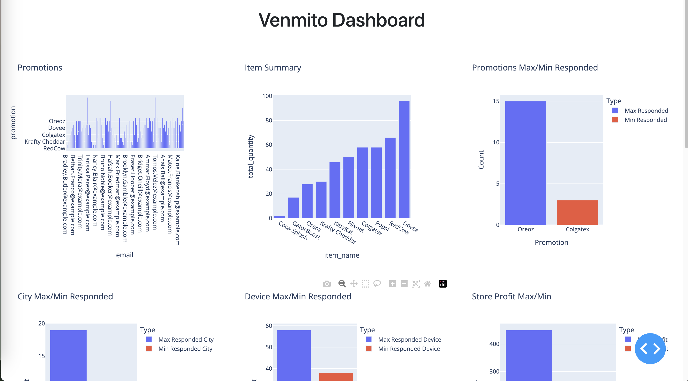

# Venmito Data Engineering Project

## Author Information

- **Name**: Piero Teran
- **Email**: pieroteran@outlook.com

## Project Description

This project is a comprehensive data engineering solution developed in Python. It is designed to import data from multiple sources, process it, and store it in a PostgreSQL database. The solution includes a Flask-based web API and a Dash dashboard for visualizing data insights. The project aims to provide a robust framework for data analysis and visualization, enabling users to interact with and explore data efficiently.

### Key Features

- **Data Importer**: A flexible tool to import data from various formats such as JSON, CSV, XML, and YAML into a PostgreSQL database.
- **Flask API**: A RESTful API that provides endpoints for querying and analyzing data.
- **Dash Dashboard**: An interactive dashboard for visualizing data insights, built using Dash and Plotly.

## Technologies Used

- **Python**: The core programming language used for developing the solution.
- **Flask**: A lightweight WSGI web application framework used to build the API.
- **Dash**: A Python framework for building analytical web applications.
- **Plotly**: A graphing library used for creating interactive plots.
- **PostgreSQL**: A powerful, open-source object-relational database system.
- **SQLAlchemy**: An SQL toolkit and Object-Relational Mapping (ORM) library for Python.
- **Bootstrap**: A front-end framework used for styling the dashboard.

## Prerequisites

Before you begin, ensure you have met the following requirements:

- Python 3.6 or later installed on your machine.
- PostgreSQL installed and running.
- Access to the database with the necessary permissions to create tables.

## Installation

1. **Clone the Repository**:
   ```bash
   git clone <repository-url>
   cd Venmito-piter-24
   ```

2. **Set Up a Virtual Environment**:
   ```bash
   python -m venv venv
   source venv/bin/activate  # On Windows use `venv\Scripts\activate`
   ```

3. **Install Dependencies**:
   ```bash
   pip install -r requirements.txt
   ```

## Database Setup

To set up the database, you need to run the `init_db.py` script. This script will create the necessary tables in your PostgreSQL database.

### Running `init_db.py`

1. **Ensure PostgreSQL is Running**: Make sure your PostgreSQL server is running and you have access to it.

2. **Run the Script**:
   ```bash
   python init_db.py --user <db_user> --password <db_password> --host <db_host> --port <db_port> --db <db_name>
   ```

   Replace `<db_user>`, `<db_password>`, `<db_host>`, `<db_port>`, and `<db_name>` with your actual database credentials.

3. **Expected Output**: The script will print messages indicating whether each table was created successfully or already exists.

## Data Import

The `data_importer.py` script is used to import data from various file formats into the database. It processes files such as JSON, YAML, CSV, and XML, and inserts the data into the corresponding tables.

### Running `data_importer.py`

1. **Run the Script**:
   ```bash
   python data_importer.py <directory> --user <db_user> --password <db_password> --host <db_host> --port <db_port> --db <db_name>
   ```

   Replace `<directory>` with the path to the directory containing your data files.


# Venmito API

## Overview

This document provides an overview of the API endpoints available in the Venmito application. Each endpoint is designed to perform specific operations related to clients, promotions, items, stores, and transfers.

## API Endpoints

### Clients

- **GET /clients/promotions**
  - Description: Fetches all client promotions.
  - Response: A list of promotions associated with clients.

### Promotions

- **GET /promotions/responded/max_min**
  - Description: Retrieves the maximum and minimum responded promotions.
  - Response: Details of the promotions with the highest and lowest responses.

- **GET /promotions/responded/city/max_min**
  - Description: Retrieves the city with the maximum and minimum responded promotions.
  - Response: Details of the cities with the highest and lowest responses.

- **GET /promotions/responded/device/max_min**
  - Description: Retrieves the device type with the maximum and minimum responded promotions.
  - Response: Details of the devices with the highest and lowest responses.

### Items

- **GET /items/summary**
  - Description: Provides a summary of items, including total quantities and prices.
  - Response: A summary of all items.

### Stores

- **GET /stores/profit**
  - Description: Retrieves the store with the most and least profit.
  - Response: Details of the stores with the highest and lowest profits.

- **GET /stores/profit/list**
  - Description: Lists all stores with their total profits.
  - Response: A list of stores and their profits.

- **GET /stores/quantity/max_min**
  - Description: Retrieves the store with the maximum and minimum quantity of items sold.
  - Response: Details of the stores with the highest and lowest quantities sold.

### Transfers

- **GET /transfers/total**
  - Description: Retrieves the total amount transferred.
  - Response: The total amount of all transfers.

- **GET /transfers/max_min**
  - Description: Retrieves the person with the maximum and minimum amount transferred.
  - Response: Details of the persons with the highest and lowest amounts transferred.

- **GET /transfers/device/total**
  - Description: Retrieves the total amount transferred by device type.
  - Response: Total amounts transferred via Android, Desktop, and iPhone devices.


## Running the API

To run the API, execute the following command:

```bash
python venmito_api.py --user <db_user> --password <db_password> --host <db_host> --port <db_port> --db <db_name>
```

Replace `<db_user>`, `<db_password>`, `<db_host>`, `<db_port>`, and `<db_name>` with your actual database credentials.

## Running the Dashboard

The Venmito Dashboard provides a visual interface to interact with the data processed by the API. Follow these steps to run the dashboard:

1. **Ensure the API is Running**: Before starting the dashboard, make sure the Venmito API is running. You can start the API using the following command:

   ```bash
   python venmito_api.py --user <db_user> --password <db_password> --host <db_host> --port <db_port> --db <db_name>
   ```

   Replace `<db_user>`, `<db_password>`, `<db_host>`, `<db_port>`, and `<db_name>` with your actual database credentials.

2. **Start the Dashboard**: Once the API is running, you can start the dashboard by executing the following command:

   ```bash
   python dashboard.py
   ```

3. **Access the Dashboard**: Open a web browser and navigate to `http://127.0.0.1:8050` to view the dashboard. The dashboard will automatically load data and display various graphs and insights.




4. **Explore the Dashboard**: Use the dashboard to explore different data visualizations and insights provided by the API. The dashboard is designed to update automatically with the latest data.

## Conclusion

This project provides a comprehensive setup for processing, analyzing, and interacting with data for Venmito. The API endpoints and dashboard offer a flexible way to query and visualize data insights.

