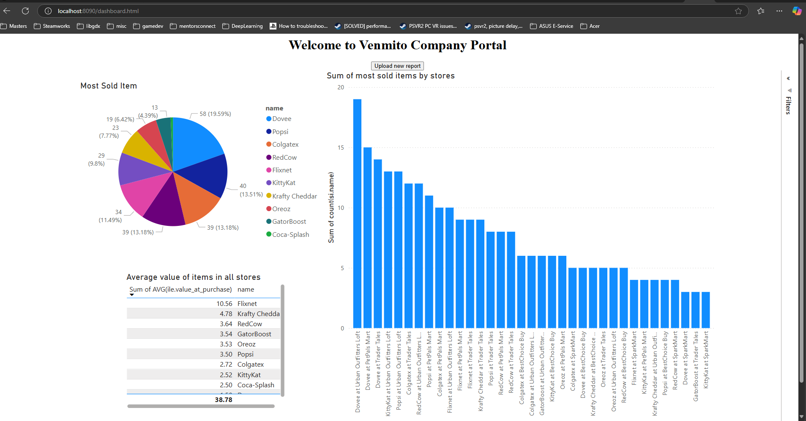
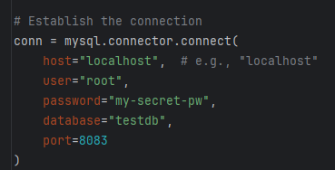

# Venmito Data visualization app

Name: Antonio Ahmed Tapia Maldonado
Email: antonio.tapia@upr.edu    

## App running

## Summary
My solution for this project included multiple parts among them a java spring web application, Python 3 scripts and sql queries together with Power BI to generate reports. The web application presents the latest report and analytics created by business in Power BI. The python 3 scripts upload the contents of the data files to a database. Power BI reads the values from the database queries and makes it simple to create visualizations of the data.

## Requirements
* Java 17+
* liquidbase
* JUnit
* Spring JPA
* MySQL server
* JWT
* Spring
* Spring Security
* Python 3+
* A Pip library named : pyyaml
* A Pip library named : mysql-connector-python

## Design decisions:
1. To use python to upload the data into the database. Because it was very quick and easy to script.
2. To use Spring boot to host the web page. Because of my familiarity with java I can get something up quickly.
3. To use pure html, css, and javascript for developing the webpage. Because it is the fastest way to develop a simple interface.
4. To use Power BI, to create charts of the data. Power BI is a easy tool to use that requires minimum training. Also it can be used be technical and non technical people. It can also be embeded into existing applications.
5. To use Azure to host the web site. Because it has a student program with a cheap vm to host the website.
6. When creating the report of data I decided to divide the graphs into Promotions, Transfers, Store Sales, Items and Metadata. I made this choice because it seem like the most simple way to classify the data. I also decided to use user ids instead names to obscure the users data.
7. I chose mysql as it is the database management system I prefer

## Instructions on how to run your code:

#### Opening the web page
1. Open an internet browser
2. Navigate to the follwing url: http://4.227.155.79:8090/
3. Enter a valid user/password combination

#### To run the Spring Webpage:
1. Create a mysql database and have it running on port 8083
2. Create the environment variable velow with the appropriate data:
    * DATABASE_PASSWORD: password login into the database
    * DATABASE_URL: url of the the given database
    * DATABASE_USER: username of the database user
    * JWT_SECRET: secret used to generate JWT tokens
3. Navigate to the root folder(/SpringWebServer) of the Spring app and then run the gradle command `gradlew bootRun`
4. Enter and navigate to the url `http://localhost:8090/` on your browser 
5. Enter the username and password to login

#### Running the Python Scripts
To run the scripts just execute the two following commands:

1. Navigate to the pythonScripts folder
2. create a venv 
3. source ./myenv/Scripts/activate
4. pip install the following dependencies
    - pip install mysql-connector-python
    - pip install pyyaml
    - you only need to run this step once  
5. Input the database information that you wish to upload the text data to. To do this modify the following lines of code in the given script you wish to run:
   - 
6. Input the file information that you wish to upload the text data from. To do this modify the following lines of code in the given script you wish to run:
   - 
7. Run the following command inputing the script name `python "scriptname"`

## Future Work:
- Implementing the backend to automatically load new files into the database
- Upgrading the Python 3 scripts into a tool that simplifies the upload and parsing of files