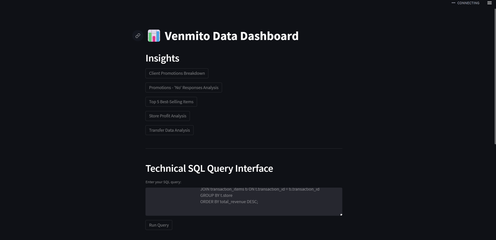
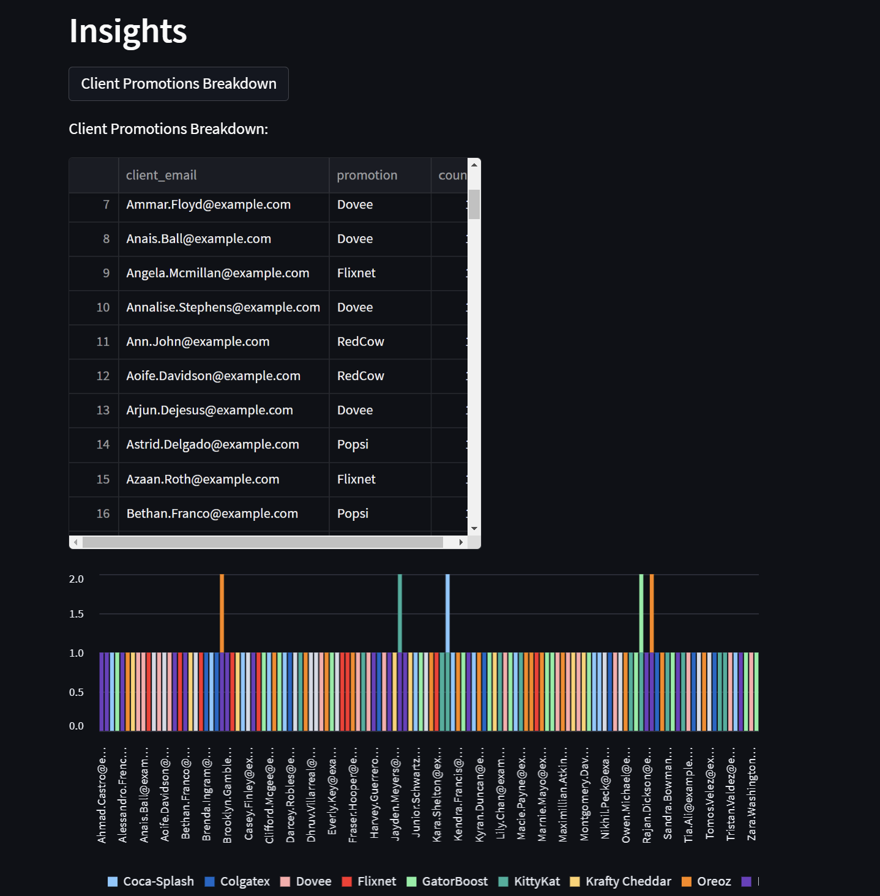
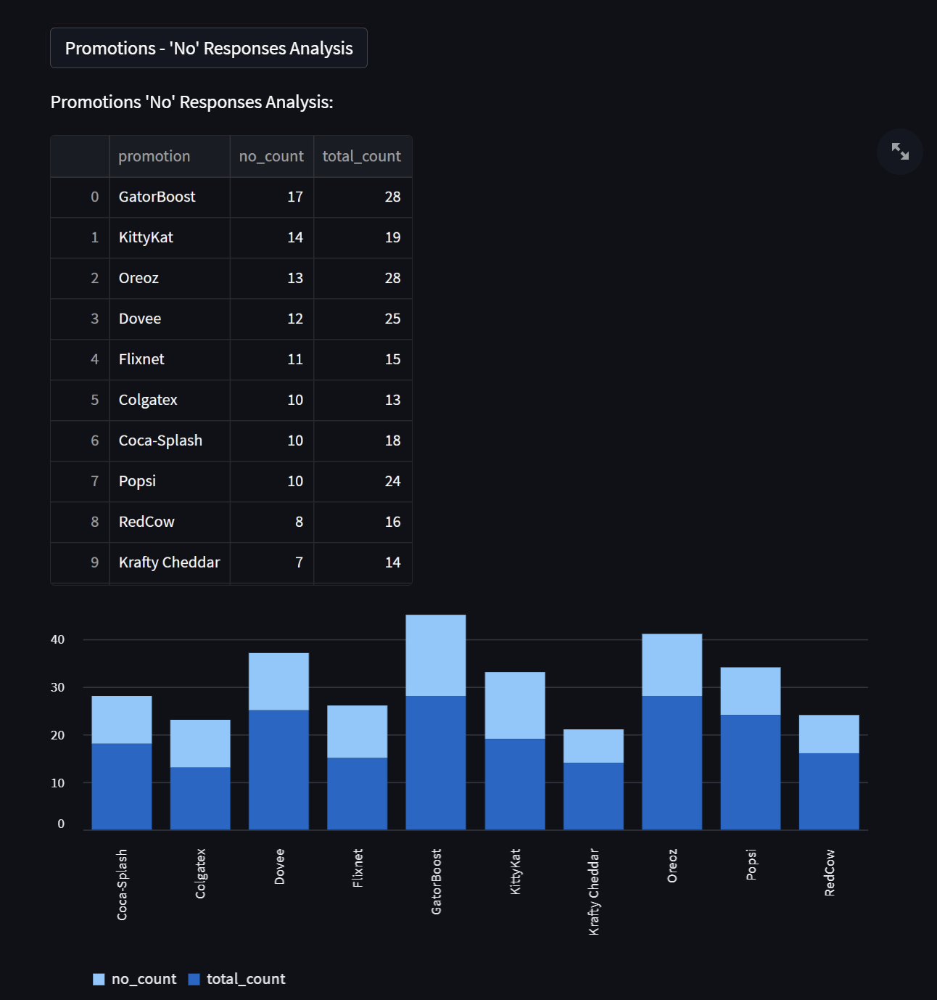
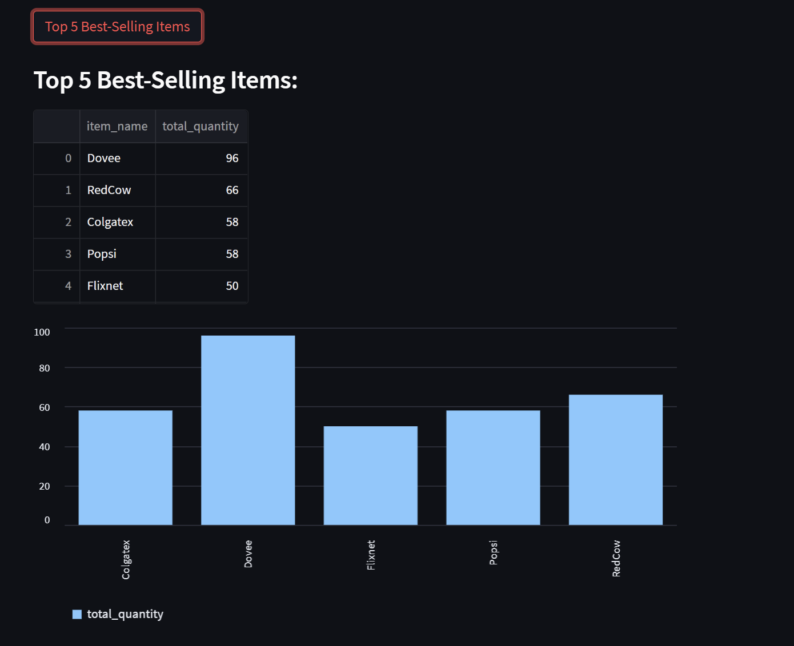
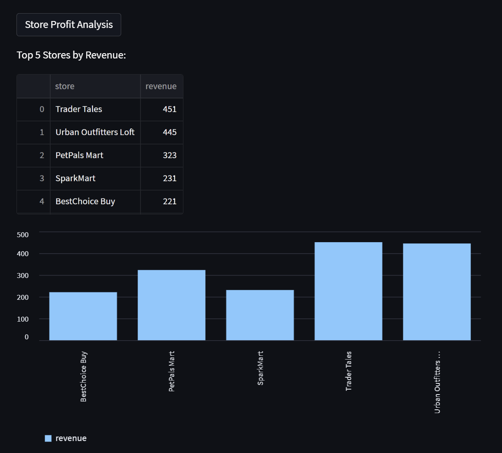
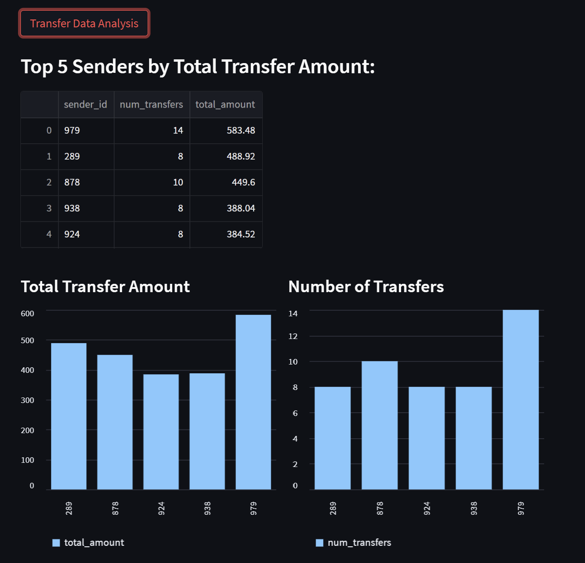

# Venmito Data Processing & Analysis

## Project Overview

Venmito is a data processing and analysis system designed to ingest, store, and analyze structured data related to transactions, promotions, and transfers. This project includes:

- **Data Ingestion:** Processing CSV, JSON, YAML, and XML files.
- **Database Management:** Storing conformed data in PostgreSQL.
- **Data Analysis & Insights:** Generating business insights via a **Streamlit Dashboard**.
- **Technical Query Execution:** Allows advanced users to write SQL queries.
- **Data Visualization:** Interactive charts for understanding trends.

## App









---

## Project Structure

```
.
├── INSTRUCTIONS.md          # Project submission guidelines
├── LICENSE                  # Open-source license
├── requirements.txt         # Python dependencies
├── data                     # Raw data files
│   ├── people.json          # JSON data for people
│   ├── people.yml           # YAML data for people
│   ├── promotions.csv       # CSV data for promotions
│   ├── transactions.xml     # XML data for transactions
│   └── transfers.csv        # CSV data for transfers
└── src                      # Source code
    ├── app.py               # Streamlit dashboard
    ├── database.py          # Database schema & setup
    ├── ingest.py            # Data ingestion pipeline
    ├── data_ingestion       # Data handling modules
    │   ├── read_formats.py  # File parsing logic
    │   └── data_handlers.py # Data transformations
```

---

## Setup & Installation

### **1. Install Dependencies**

```bash
pip install -r requirements.txt
```

### **2. Set Up the PostgreSQL**

```bash
# Start the PostgreSQL server (if not already running)
sudo systemctl start postgresql
sudo systemctl enable postgresql
```

### **3. Create the Database**

```bash
psql -U user -h localhost -d postgres
```

In SQL:

```bash
CREATE DATABASE venmito;
```

### **4. Set Up the Database**

```bash
python src/database.py
```

This will create the necessary PostgreSQL tables if they do not already exist.

### **5. Run Data Ingestion**

```bash
python src/ingest.py
```

This script reads from the `data/` folder, processes, and inserts data into the database.

### **6. Start the Streamlit App**

```bash
streamlit run src/app.py
```

---

## Streamlit Dashboard Features

### **For Non-Technical Users**

- **Client Promotions Analysis:** See which clients received what promotions.
- **Promotion Optimization:** Identify strategies to convert “No” responses.
- **Best-Selling Items:** Find the top-performing products.
- **Store Performance:** Analyze stores with the highest revenue.
- **Transfer Insights:** Understand money transfer patterns.

### **For Technical Users**

- **SQL Query Editor:** Write & execute custom SQL queries directly.
- **Data Visualization:** Plot queried data dynamically.

---
