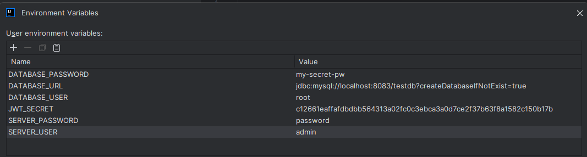

This repository holds the source code for the backend service for the venmito project to run it you need a mysql database 
running on port 8083 and the correct username/password combo for that db instance

Additionally you need to set the environment variables like the ones set out on the ENVIRONMENT.TXT file:
- export DATABASE_URL=jdbc:mysql://localhost:8083/mydatabase?createDatabaseIfNotExist=true
- export DATABASE_USER=root
- export DATABASE_PASSWORD=my-secret-pw
- export SERVER_USER=admin
- export SERVER_PASSWORD=password
- export JWT_SECRET=c12661eaffafdbdbb564313a02fc0c3ebca3a0d7ce2f37b63f8a1582c150b17b

An example of how to set these up in intellij community is in the iamge below

Dependencies:
* liquidbase
* JUnit
* JPA
* MySQL
* JWT
* Spring
* Spring Security

